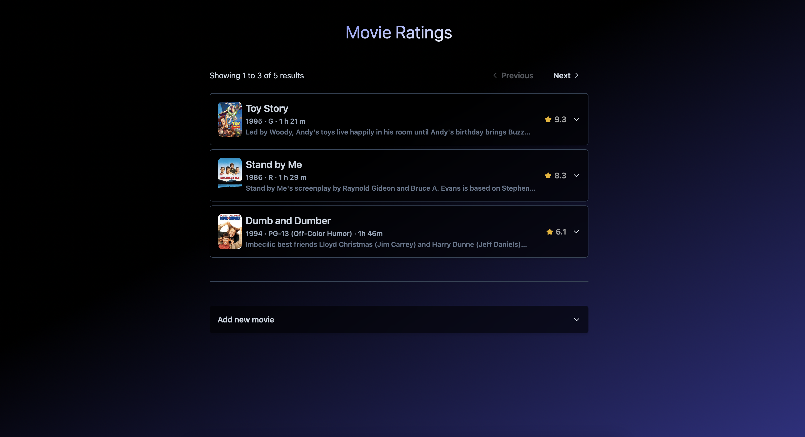

# Movie Scraping Project




A **PERN** stack JavaScript solution for comparing movie ratings, built with a Monorepo structure.


# Table of Contents
- [Movie Scraping Project](#movie-scraping-project)
- [Table of Contents](#table-of-contents)
- [Introduction](#introduction)
- [Monorepo Structure](#monorepo-structure)
- [Installation](#installation)
  - [Prerequisites](#prerequisites)
  - [Installation](#installation-1)
  - [Quick Setup (Dockerized)](#quick-setup-dockerized)
  - [Running from the Host System](#running-from-the-host-system)
  - [Database (Migration/Seed)](#database-migrationseed)
- [Project Structure](#project-structure)
  - [Apps and Packages](#apps-and-packages)
    - [Applications](#applications)
    - [Packages](#packages)
- [Designs and Architectures](#designs-and-architectures)
  - [Frontend](#frontend)
    - [Atomic Design Pattern](#atomic-design-pattern)
    - [Backend Providers and Hooks](#backend-providers-and-hooks)
  - [Backend](#backend)
    - [RESTful API Design](#restful-api-design)
    - [Object-Based Routes Pattern](#object-based-routes-pattern)
    - [Authentication](#authentication)
    - [Caching Mechanism](#caching-mechanism)
    - [Cache Invalidations](#cache-invalidations)
    - [Scalability Consideration](#scalability-consideration)
- [Other Considerations](#other-considerations)
- [Improvements](#improvements)


# Introduction

The Movie Scraping Project is a robust solution designed to compare movie ratings across 3 major platforms ([IMDb](https://www.imdb.com), [Rotten Tomatoes](https://www.rottentomatoes.com), [Meta Critic](https://www.metacritic.com)). Built using the PERN stack (PostgreSQL, Express.js, React, Node.js), this project leverages a monorepo structure to maintain a seamless integration between frontend and backend components.

Key Features:
- **Dynamic Rating Comparison**: Scrape and aggregate movie ratings from multiple sources to provide a comprehensive comparison.
- **Interactive Visualization**: Utilize React to deliver an engaging and responsive user interface for exploring and analyzing rating data.
- **Scalable Architecture**: Employ the PERN stack to ensure a scalable and efficient application structure, with PostgreSQL for reliable data storage, Node.js for server-side logic, and Express.js for API management.
- **Monorepo Organization**: Manage both frontend and backend applications in a single repository, simplifying development, testing, and deployment.


# Monorepo Structure

This project adopts a monorepo approach to maximize the benefits of separation of concerns while ensuring seamless code and implementation sharing across multiple apps and packages. This structure enables efficient collaboration, consistency, and reuse of components, making it easier to manage and scale the project.

# Installation

To get started with the Movie Scraping Project, follow these instructions to set up the monorepo and run both frontend and backend applications.

## Prerequisites
Before you begin, make sure you have the following installed:

- Node.js (v18.x or higher) - Download [Node.js](https://nodejs.org/en/download/package-manager)
- Yarn or npm - Install Yarn (if you prefer Yarn over npm)
- Docker (Containerize setup and local live development) - Install Docker

## Installation

1. Clone the Repository:

    Clone the repository to your local machine using Git:

    ```bash
    git clone https://github.com/bosquejun/movie-scraper
    cd movie-scraper
    ```

2. Install Dependencies:

    Navigate to the root directory of the monorepo and install dependencies for all applications and packages:

    ```bash
    yarn install
    # or
    npm install
    ```
    > If using Yarn Workspaces or a similar tool, dependencies for all projects within the monorepo will be installed automatically.

3. Environment Configuration:
    
    Create .env on root directory. Copy the example env file (`./env.sample`) and modify them as needed:

    ```bash
    cp ./.env.example ./.env
    ```

## Quick Setup (Dockerized)

This project utilizes Docker to streamline the setup process, handling everything from database and cache services (Postgres and Redis) to application installation and execution.

Run:

```bash
./local/quick-setup.sh
# or
docker compose run api yarn install && docker compose up -d
```

## Running from the Host System

Alternatively, you can run the frontend and API applications directly from your host machine, outside of Docker. To do this, you can start both applications simultaneously from the root project directory using the Turbo command:

```bash
# /movie-scraper
yarn dev
```

or  you can run each application individually by navigating to its respective directory and executing the development command:

- API server application
    ```bash
    # /movie-scraper/apps/api
    yarn dev
    ```
- Frontend react application
    ```bash
    # /movie-scraper/apps/frontend
    yarn dev
    ```

> Troubleshoot: If you want to switch the Frontend app from Docker to Host system or vice versa, you may need to run `yarn install` (targeting the host) or `docker compose run frontend yarn install` (targeting the docker) to resolve the platform issue with `vite+@rollup`

## Database (Migration/Seed)

Database tables and some predefined data are being seeded on [setup]((#quick-setup-dockerized)). This includes the following tables:

- Movie
- MovieRating
- User
- UserAclRole
- UserRole

Also, 2 entry users are added for easy setup and access:

- System user (Used by the frontend to access backend service [list movies]):
    ```json
    {
        "email": "system@comeback.com",
        "password": "password@1234!"
    }
    ```
- Admin user (To use for adding new movie):
    ```json
    {
        "email": "admin@comeback.com",
        "password": "password@1234!"
    }
    ```

# Project Structure

This project includes the following packages/apps:

## Apps and Packages

### Applications
- `api`: A RESTful API backend application built with Node.js, Express.js, and PostgreSQL, complemented by Redis for caching.
- `frontend`: A dynamic web application developed with React.js and styled using TailwindCSS.

### Packages
- `@comeback/errors`: A package for handling various types of errors, including application-level and HTTP-level errors.
- `@comeback/express-lib`: A library designed for managing Express.js-related code and functionalities, primarily used by the backend api application.
- `@comeback/logger` - A versatile logging package for managing logging across both frontend and backend applications.
- `@comeback/model` - A package for managing database configurations, models, and related database layer integrations, built using Sequelize.
- `@comeback/react` - A React.js package facilitating integration with the backend API, providing context, providers, and custom hooks for seamless connectivity.
- `@comeback/redis` - A package for managing Redis clients, enabling efficient caching mechanisms.
- `@comeback/schema` - A package for defining and validating schemas, ensuring consistency across applications and packages. It uses `Typebox`.
- `@comeback/ui` - A React package for shared UI components and elements, providing a foundation for consistent user interfaces.


# Designs and Architectures

## Frontend

The main ReactJS application is a very small app that doesn't need any design-patterns as it is using the `@comeback/ui` + `@comeback/react` packages for components and backend  integrations.

### Atomic Design Pattern

`@comeback/ui` follows the *Atomic Design Pattern* to create a library of reusable and modular UI components. By using this pattern, the package benefits from:

- **Consistency**: Ensures a cohesive design system by breaking down the UI into fundamental elements (atoms, molecules, organisms, templates, and pages) that can be consistently reused across the application.

- **Scalability**: Facilitates the scalable development of complex user interfaces by allowing developers to build and manage smaller, independent components that can be easily composed into larger, more complex structures.

- **Maintainability**: Enhances maintainability and reduces duplication by providing a clear structure for components, making it easier to update and manage the UI over time.

- **Flexibility**: Promotes flexibility and adaptability in design by enabling the easy replacement or modification of individual components without affecting the overall system.

- **Efficiency**: Speeds up development by leveraging pre-defined, reusable components that can be quickly assembled to build new features or screens.

### Backend Providers and Hooks

`@comeback/react` offers a suite of contexts, providers, and custom React hooks designed to streamline integration with the api application. This package simplifies interaction with the backend by:

- **Encapsulating API Calls**: Wrapping API requests for fetching and updating platform data, making data management straightforward and consistent.

- **Authentication Support**: Handling user authentication, including login processes and JWT management, to ensure secure and efficient user sessions.

- **Streamlining Integration**: Providing reusable components and hooks to seamlessly connect the frontend with backend services, reducing boilerplate code and enhancing development productivity.

## Backend

### RESTful API Design

Designs APIs around standard HTTP methods (GET, POST, PUT, DELETE) and resources, making them intuitive and easy to use. Resources are represented by URLs, and operations on these resources are performed using the corresponding HTTP methods, which enhances clarity and consistency in API interactions.

### Object-Based Routes Pattern

The api application employs an Object-Based Routes Pattern to organize API routes and endpoints. In this pattern, each route is defined as a key consisting of a combination of `method` and `endpoint`, with associated values being the route handlers. These `handlers` include the main logic as well as any `middleware functions`, such as authentication and caching, which are applied to the routes. This approach streamlines route management and enhances code organization.

### Authentication

The backend API employs JWT-based authentication combined with basic role-based permissions. This setup secures endpoints by ensuring that only authorized users and systems can access them, providing controlled access based on user roles and permissions.

### Caching Mechanism

The backend utilizes Redis to support caching mechanisms and reduce database load, particularly for frequently accessed endpoints. An Express middleware is provided with optional configuration to cache responses for specific routes, enhancing performance and scalability.

### Cache Invalidations

In addition to the default or explicitly set `TTL` (Time-To-Live) values for route endpoint caching, the system includes mechanisms to invalidate cached data across various parts of the application. For instance, when data is mutated (`created or updated`), the system uses `Sequelize Hooks Events` to listen for specific events and trigger cache invalidation, ensuring that outdated data is removed and the cache remains current.

### Scalability Consideration

The backend API is designed as a `stateless` application, making it well-suited for `horizontal scaling` by increasing the number of application containers. With `Redis` serving as a centralized caching layer, all instances of the application share the same cache. This ensures that `cache invalidation` is effectively synchronized across all instances, maintaining consistency and performance as the application scales.

# Other Considerations

- **What data is stored?**

    The backend API supports a movie scraping feature that fetches and stores information about movies, including `title`, `releaseDate`, `director`, `rating`, `runtime`, `posterImage`, `synopsis`, `url`, and `rating score`. This data is fetched in a manner that respects the source's terms defined from `robots.txt`.

- **How is the data stored? Are any aggregations stored?**

    - When scraping movie information, the system `respects` the `scraping rules` defined by the source, as specified in the `robots.txt` file.

    - Data is organized using a `Movie-MovieRating` relationship. For each new movie, a movie entry is created, followed by the addition of a corresponding movie-rating entry. If a new request provides a movie `title` that already exists, the system updates the existing movie entry and adds a new movie-rating entry if it originates from a different source.
    
    - A simple data aggregation is being done on application-level to get the `average rating source` of the movie from all the sources available.

- **How easy is it for other owned systems to utilise the data?**

    The data provided by the backend API is designed to be easily accessible and integrable by other systems. With a well-defined RESTful API, other systems can interact with the data through standard HTTP requests. The API follows best practices for data access and integration, ensuring that the data can be seamlessly consumed and utilized by other applications, services, or platforms.
    
    However, it is important to note that most endpoints are protected by authentication mechanisms. Ensure that appropriate authentication tokens or credentials are used when accessing these endpoints to maintain data security and prevent unauthorized access.

- **How performant is the application/How scalable is the application?**

    The application is designed with performance in mind. Key aspects contributing to its efficiency include:

    - **Caching Mechanisms**: By leveraging Redis for caching frequently accessed data, the application reduces database load and speeds up response times for common queries.

    - **Scalability**: The stateless design of the backend API supports horizontal scaling, allowing the application to handle increased traffic and load by adding more instances as needed.

    - **Response Times**: The use of caching, combined with efficient database interactions and data processing, contributes to low latency and high responsiveness for API requests.

- **How does the application handle errors?**

    - **Centralized Error Handling**: The backend API uses middleware to centralize error handling. This approach captures and processes errors uniformly, allowing for consistent error responses and logging throughout the application.

   - **Centralized Schema Definitions**: The platform utilizes centralized schemas defined with Typebox to ensure type safety and consistency across both frontend and backend applications. This approach standardizes data structures and validation rules, promoting uniformity and reducing discrepancies throughout the platform. By using a shared schema definition, the system ensures that data adheres to the same format and constraints, enhancing data integrity and simplifying maintenance.


# Improvements

1. Testings (Unit, Integrations, E2E)
2. Proper Documentations
   - Source code comments
   - API Documentations
   - Other tech designs such as ERD, UMLs, etc.
3. Other coding improvements adhering Industry best practices and standards.
4. Local Load Balancing setup to handle proper integration of frontend to horizontally scaled backend API instances.